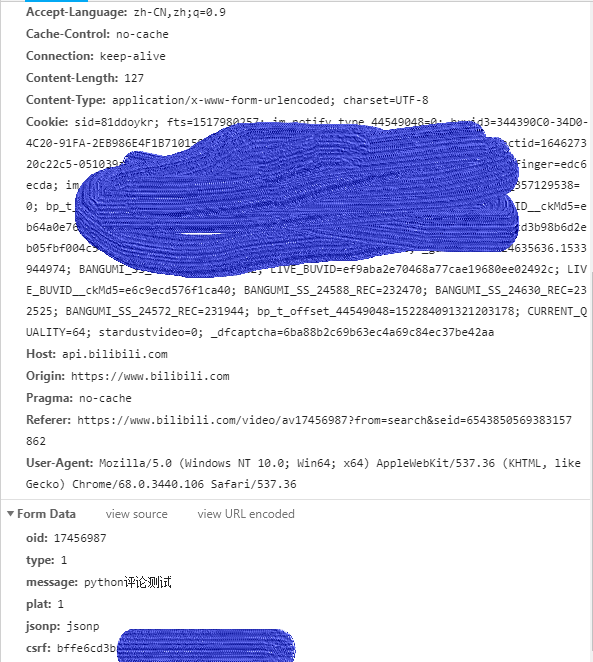

# 目前bili中可以使用的方法
- ### 使用之前务必完善user_info中的信息
  - cookies
  - csrf
  - 其他信息可以自行修改（如果你知道自己要干什么的话）

**这些信息可以从浏览器评论时抓包获取
（这里浏览器推荐chrome，可以完成同样功能的其他浏览器也可）
以下是某次评论抓包的部分headers和data**

这里只大致介绍用法，具体的参数类型见脚本内的注释
-
- ### send_comment(aid, message, write=True) -> str
**通过模拟请求来完成对指定视频的评论发送,并在本地记录相关信息**
- ### del_comment(rpid, aid)->bool
 **通过模拟请求来完成评论的删除，和上面的类似**
- ### danmaku_report(cid, dmid, referer, reason='10')->bool
**利用弹幕编号dmid等信息举报弹幕**
- ### ep_2_av(ep)->str
**给定视频的ep号，返回对于的av号，用于发送评论等**
- ### auto_reply(ep, message)->str
**自动在指定的视频下发送评论**
- ### auto_action(rpid, referer, oid, action='1')->bool
**自动给评论点赞**
- ### get_comment(aid, page=1)->str
**获得指定视频的评论**
- ### get_hots(aid, write=True)->[str]
**获得视频的热评**
- ### get_cid_av(av)->str
**用于获得指定视频的cid，有了cid就可以发弹幕、获得弹幕**
- ### get_danmaku_aid(cid)->[str]
**获取原始的弹幕，返回字符串列表**
- ### get_num_danmaku(av, write=True, name='danmaku.txt')->int
**利用cid来获取某个视频的全部弹幕，并写入文件，有待改进，例如记录弹幕的各种属性**
**最后返回弹幕的总条数，注意是当前的弹幕总数，不是历史总数，因为弹幕池有上限**
- ### first_floor(ep, message, run_time='22:23')
**为了更加自动的实现在指定时间段的抢楼，使用轻量的schedule实现定时任务**
  **用于实现自动在未来预测的某个视频下抢楼，抢楼是违规行为**
  ## **这里仅用于学习，请勿用于商业或其他非法！**
- ### 其他未完成的功能
  - 发送弹幕
  - 获得ep视频的cid
  - 举报弹幕、评论
  - ......
